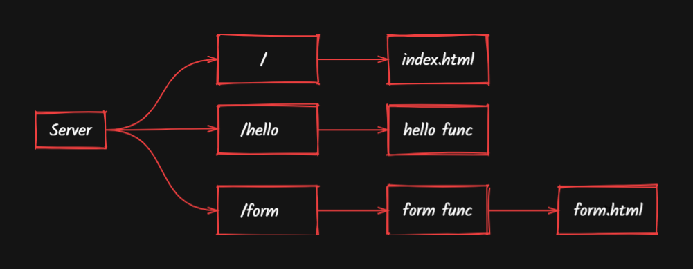

# Simple Web Server

# Architecture Design

This is a simple web server architecture design using golang (Programming Language)

Build Go main file: `go build`
Then run the main file: `go run main.go`

This is what we get on `http://localhost:8080`

Now on Form.html : `http://localhost:8080/form.html`

On Submission of Form : Redirected to -> : `http://localhost:8080/form`
